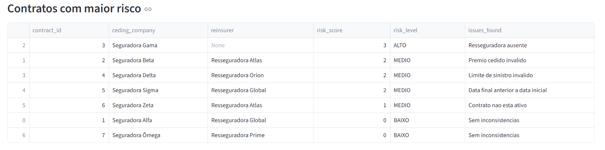

# Reseguro 360: Automação Regulatória e Contábil

## Dashboard online

Acesse o dashboard interativo:

https://reseguro-360-automacao-regulatoria-e-contabil.streamlit.app

## Preview do dashboard



Projeto demonstrativo em Python com foco na automação de controles regulatórios, financeiros e contábeis aplicados à operação de resseguro.

## Objetivo

Simular uma rotina de monitoramento regulatório para contratos de resseguro, permitindo:

- leitura de contratos
- validação automática de regras regulatórias
- geração de relatório de conformidade
- cálculo de score de risco regulatório
- classificação de contratos por nível de risco
- visualização em dashboard interativo

## Problema de negócio

Operações de resseguro exigem controle sobre contratos, status de conformidade, consistência de informações e acompanhamento de riscos operacionais e regulatórios.

Este projeto foi desenvolvido como um protótipo de automação para apoiar:

- monitoramento de conformidade
- identificação de inconsistências contratuais
- priorização de contratos com maior risco regulatório
- geração de relatórios para acompanhamento operacional

## Funcionalidades

- Validação de contratos de resseguro a partir de arquivo CSV
- Regras automáticas de conformidade
- Geração de relatório consolidado em CSV
- Cálculo de `risk_score`
- Classificação de `risk_level` em `BAIXO`, `MEDIO` e `ALTO`
- Dashboard em Streamlit
- Métricas executivas de conformidade
- Gráfico de distribuição de conformidade
- Gráfico de distribuição de nível de risco
- Filtro por risco
- Filtro por status de conformidade
- Alertas para contratos de alto risco
- Download do relatório em CSV

## Estrutura do projeto

```text
reseguro-360-automacao-regulatoria-e-contabil
│
├── app
│   └── streamlit_app.py
│
├── data
│   └── reference
│       └── contracts.csv
│
├── reports
│   └── compliance_report.csv
│
├── src
│   └── regulatory_rules.py
│
├── docs
├── requirements.txt
└── README.md

## Regras de validação aplicadas

O script de validação verifica, entre outros pontos:
existência da resseguradora
prêmio cedido maior que zero
limite de sinistro maior que zero
coerência entre data inicial e data final
status ativo do contrato
A partir dessas verificações, o sistema gera:

compliance_status
issues_found
risk_score
risk_level

##Tecnologias utilizadas

Python
Pandas
Streamlit
PowerShell
Git e GitHub

##Como executar o projeto
1. Clonar o repositório
git clone https://github.com/annapatricia/reseguro-360-automacao-regulatoria-e-contabil.git
cd reseguro-360-automacao-regulatoria-e-contabil
2. Criar ambiente virtual
python -m venv .venv
3. Ativar o ambiente virtual

No Windows PowerShell:

.\.venv\Scripts\Activate
4. Instalar dependências
pip install -r requirements.txt
5. Gerar o relatório regulatório
python src/regulatory_rules.py
6. Rodar o dashboard
streamlit run app\streamlit_app.py
Exemplo de saída

O relatório final contém colunas como:

contract_id
ceding_company
reinsurer
premium_ceded
claim_limit
compliance_status
issues_found
risk_score
risk_level

##Aplicação para negócio

Este projeto demonstra como transformar regras operacionais e regulatórias em um fluxo automatizado de validação e monitoramento, com potencial de aplicação em:

seguradoras
resseguradoras
áreas de compliance
controles internos
operações financeiras e contábeis

##Próximos passos

Evoluções possíveis para o projeto:
inclusão de sinistros e recoveries
conciliação financeira automática
simulação de lançamentos contábeis

##arquitetura em AWS com S3, Glue e Athena

camada de auditoria e log de execução
detecção de anomalias com machine learning


